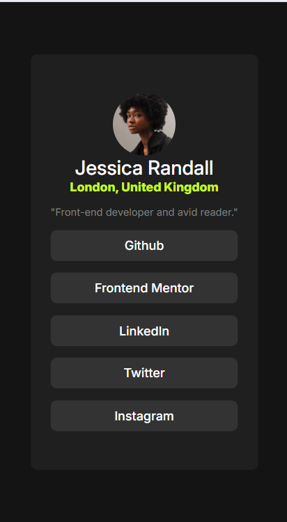

# Frontend Mentor - Social links profile solution

This is a solution to the [Social links profile challenge on Frontend Mentor](https://www.frontendmentor.io/challenges/social-links-profile-UG32l9m6dQ). Frontend Mentor challenges help you improve your coding skills by building realistic projects. 

## Table of contents

- [Overview](#overview)
  - [The challenge](#the-challenge)
  - [Screenshot](#screenshot)
  - [Links](#links)
- [My process](#my-process)
  - [Built with](#built-with)
  - [What I learned](#what-i-learned)
  - [Continued development](#continued-development)
-[Author](#Author)  

**Note: Delete this note and update the table of contents based on what sections you keep.**

## Overview
    A responsive Social link profile card, built with HTML and CSS, thats adjusts perfectly to desktop and mobile screen size

### The challenge

Users should be able to:

- See hover and focus states for all interactive elements on the page

### Screenshot

### Links

- Solution URL: [Add solution URL here](https://github.com/Zimanie/social-links-profile-card)
- Live Site URL: [Add live site URL here](https://your-live-site-url.com)

## My process

### Built with

- Semantic HTML5 markup
- CSS custom properties
- Flexbox
- Mobile-first workflow

### What I learned

I learned how to make an 'a' tag a block element.

### Continued development

I would like to continue practicing what i have learnt by implementing it in the next peoject.

## Author

- Frontend Mentor - [@Zimanie](https://www.frontendmentor.io/profile/ZImanie)
- Twitter - [@Zimanie5](https://www.twitter.com/Zimanie5)

